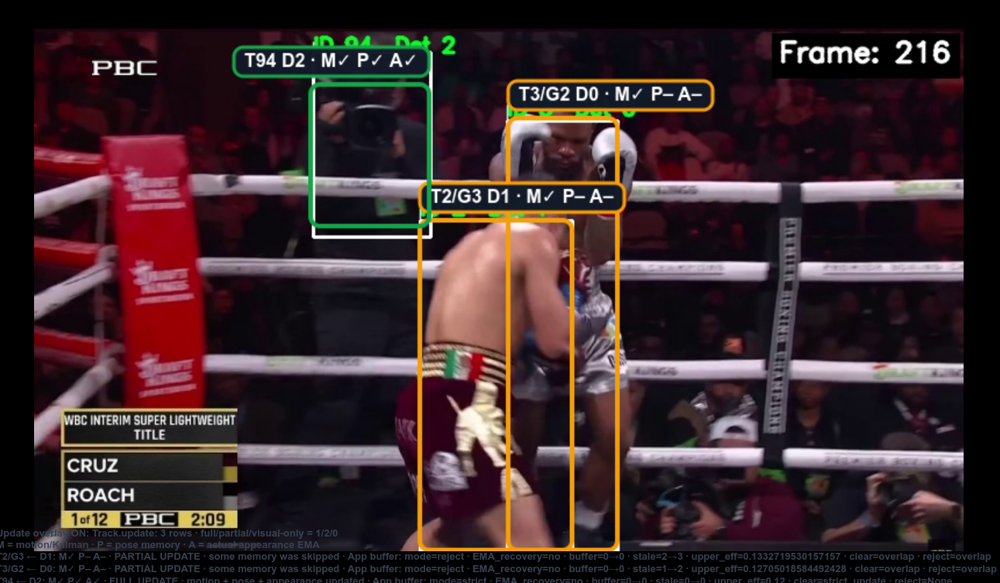
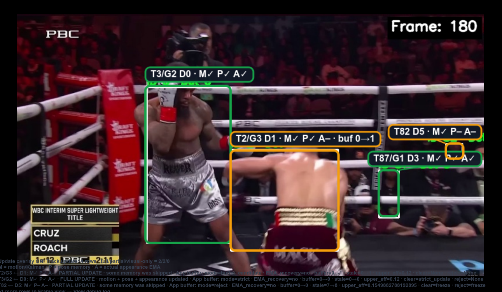
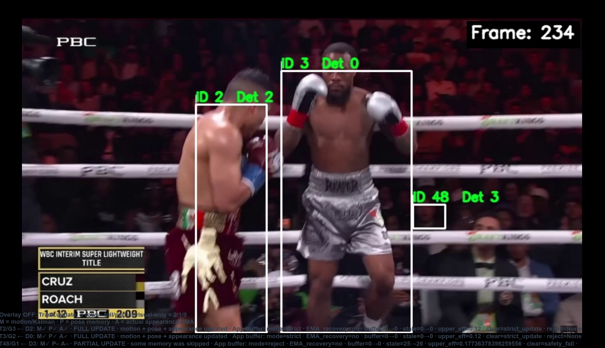
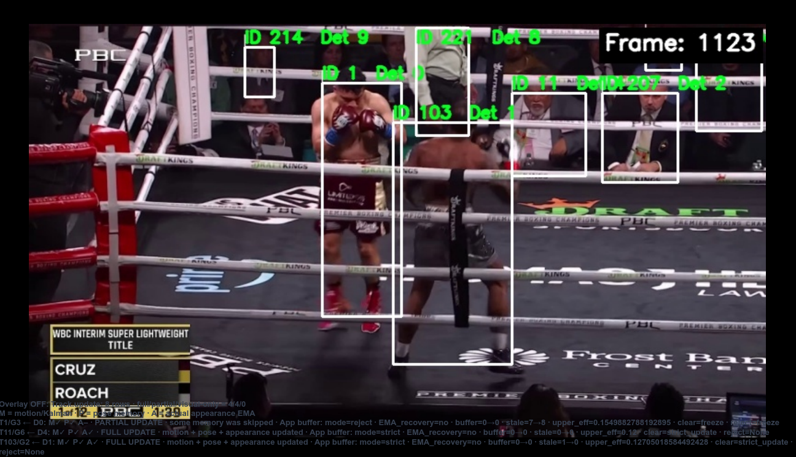
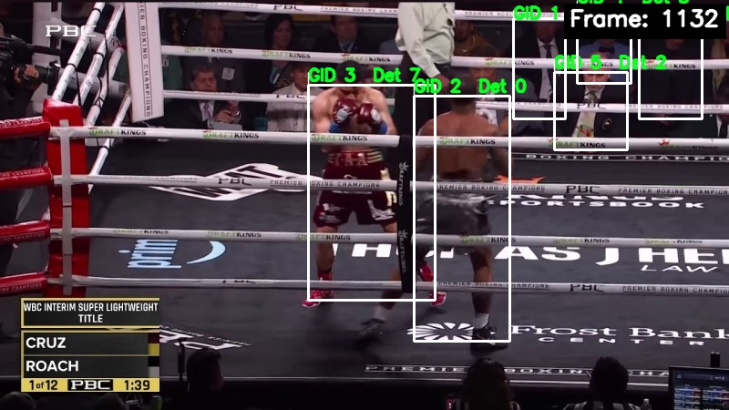
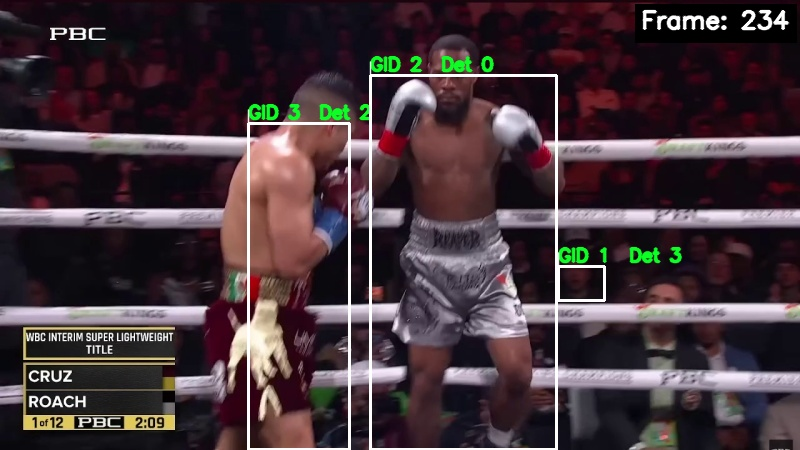

# Boxing-Specific Multi-Object Tracking

A computer vision pipeline for tracking boxers through fast motion, close-range exchanges, missed detections, and broadcast camera cuts.

This project was built to solve a practical problem in boxing analysis: before you can classify punches or count boxer-specific actions, you first need stable identities over time.

<p align="center">
  
</p>

## Why This Project Exists

Pose detectors can find people and keypoints on individual frames, but they do not reliably preserve identity over time.

In boxing, that becomes a major problem:

- fighters move quickly;
- they overlap often;
- body parts disappear during clinches and close exchanges;
- detections can be noisy or missing;
- the broadcast frequently cuts to a different camera angle.

Without a tracker, the same temporal sequence can accidentally combine skeletons from different athletes. That makes punch classification, punch counting, and per-boxer analysis unreliable.

This project solves that identity problem first.

<p align="center">
  
</p>

## What The Tracker Does

The tracker combines three types of evidence when deciding which detection belongs to which boxer:

- **motion** — whether a detection agrees with the predicted track position;
- **pose** — whether the current skeleton matches the previous body configuration;
- **appearance** — whether the boxer still looks visually similar.

That makes the system more robust than a simple frame-to-frame skeleton comparison.

<p align="center">
  
</p>

Pose comparison is treated as useful, but not fully trustworthy on its own, because boxing posture changes quickly and some joints may be partially hidden.

<p align="center">
  
</p>

The appearance representation is also boxing-specific. Instead of relying only on a generic body embedding, the tracker can combine:

- body appearance;
- left glove color information;
- right glove color information;
- shorts color information.

This makes it easier to distinguish visually similar fighters in difficult scenes.

## Why Overlap Handling Matters

Boxers often move into close contact. In these moments, a normal tracker can easily corrupt identity memory because the crop or skeleton may contain mixed information from both athletes.

To reduce that risk, this tracker includes overlap-aware logic such as:

- adaptive overlap thresholds;
- partial track updates;
- temporarily blocked appearance updates;
- freeze logic for risky identity states.

<p align="center">
  
</p>

The system also uses a temporary buffer for medium-confidence appearance observations. That allows the tracker to save potentially useful visual evidence without immediately contaminating the main identity representation.

<p align="center">
  
</p>

## Why New Tracks Are Created Conservatively

Not every unmatched detection should immediately become a confirmed track.

In fast boxing footage, noisy detections can appear briefly and disappear again. To avoid creating unstable identities, the tracker uses a conservative birth process.

<p align="center">
  
</p>

A new candidate must survive long enough and collect enough evidence before it becomes a stable confirmed track.

This helps reduce duplicate tracks and short-lived false identities.

## Local Tracks And Global Boxer Identities

The project separates identity handling into two levels:

- **local tracks** preserve identity inside one continuous camera segment;
- **global identities** merge compatible local fragments across different camera shots.

This distinction matters because a broadcast camera cut can completely change viewpoint, scale, and visible body regions.

### Local Tracking Inside One Camera Segment

Inside a single shot, the tracker maintains local track IDs frame by frame.

<p align="center">
  
  
</p>

After a camera cut, the same boxer may receive a different **local ID**, because local tracking restarts in a new shot context.

### Global Identity Recovery Across Camera Cuts

After local tracking is finished, the system compares track fragments across different epochs and groups compatible fragments into a shared global boxer identity.

<p align="center">
  
  
</p>

These two fragments can look different because of viewpoint changes, but they still belong to the same boxer. That is why the project uses **local IDs** and **global IDs** separately.

The final result is a scene where multiple local fragments can be consolidated into stable global boxer identities.

<p align="center">
  
</p>

For this step, stable local fragments are compared using track-level appearance representations, and conservative clustering is used to recover cross-shot identity continuity.

<p align="center">
  
</p>

## Why This Project Is Useful

This tracker is not only a visualization tool.

It is meant to be a foundation for downstream boxing-analysis tasks such as:

- punch classification;
- punch counting per boxer;
- temporal action recognition;
- boxer-specific movement analysis;
- later dataset preparation for learning-based models.

In other words, the project solves a prerequisite problem: it makes boxer-centered temporal analysis possible.

## Project Structure

The repository uses a standard `src` layout:

```text
Boxing_Tracking_Project/
├── pyproject.toml
├── configs/
│   ├── infer_tracks.yaml
│   ├── tracking.yaml
│   ├── birth_manager.yaml
│   └── shot_boundary.yaml
├── scripts/
│   ├── infer_tracks.py
│   ├── train_reid_osnet_siamese.py
│   └── export_reid_onnx.py
└── src/
    └── boxing_project/
        ├── tracking/
        ├── results/
        └── reid_training/
```

The installable Python package is `boxing_project`. Runtime orchestration,
results access, and optional ReID training code are kept in separate
subpackages so that each responsibility remains explicit.

## Quick Start

### Python Package Installation

From the repository root, install the project in editable mode:

```bash
python -m pip install -e .
```

Editable mode registers `src/boxing_project` as an importable package while
keeping it connected to the source tree. Changes made under `src/` are
therefore available immediately, without reinstalling the project after every
edit.

After installation, imports work normally:

```python
from boxing_project.tracking.infer_runner import InferRunner
from boxing_project.results import BoxingResults
```

No manual `PYTHONPATH=src` prefix is required.

> `pyproject.toml` installs the Python dependencies of the project. OpenPose,
> CUDA, cuDNN, Caffe, and other native runtime components still need to be
> installed separately. The Docker runtime remains the recommended option for
> reproducible full inference.

For lightweight result consumption only:

```bash
python -m pip install -r requirements/results.txt
```

This installs only the libraries required to read and work with
`observations.parquet`.

### Inference

The complete inference run is configured through:

```text
configs/infer_tracks.yaml
```

Run the pipeline from the repository root:

```bash
python scripts/infer_tracks.py
```

The same runner can also be used directly as a Python module:

```python
from pathlib import Path

from boxing_project.tracking.infer_runner import InferRunner

InferRunner(Path("configs/infer_tracks.yaml")).run()
```

Configuration responsibilities are intentionally separated:

```text
configs/infer_tracks.yaml     runtime, input, output, enabled stages, batch sizes
configs/tracking.yaml         matching, lifecycle, overlap, and clustering parameters
configs/birth_manager.yaml    pending-track and track-birth behaviour
configs/shot_boundary.yaml    camera-cut detection
```

The inference pipeline is organised into seven stages:

```text
1. Preprocessing
2. Detection Preparation
3. Local Tracking
4. Local Detection Saving
5. Global Clustering
6. Global Saving
7. Dataset Export
```

Stages can be enabled or disabled in `configs/infer_tracks.yaml`. Later stages
depend on the outputs of the earlier stages they consume.

## Appearance ReID Fine-Tuning

The tracker uses an appearance embedding to compare the visual identity of a
current detection with an existing track. The repository includes an optional
training workflow that was used to fine-tune an OSNet-style encoder for boxing
footage.

This training workflow is separate from normal inference. It is needed only
when creating or improving the appearance model; inference can use an existing
ONNX model directly.

### Training Dependencies

Install the additional ReID training dependencies:

```bash
python -m pip install -r requirements-reid.txt
```

These dependencies include PyTorch, Torchvision, Torchreid, ONNX, and the
supporting training libraries. They are kept separate because they are much
heavier than the normal result-processing dependencies.

### Pair Dataset Format

Training uses labelled image pairs:

```text
dataset_root/
├── A/
│   ├── 000001__pos_easy__w_100.jpg
│   └── 000002__neg_hard__w_280.jpg
├── B/
│   ├── 000001__pos_easy__w_100.jpg
│   └── 000002__neg_hard__w_280.jpg
└── Label/
    ├── 000001.txt
    └── 000002.txt
```

The numeric prefix is the pair identifier and must match across `A`, `B`, and
`Label`.

Labels have the following meaning:

```text
1 = the two crops show the same boxer
0 = the two crops show different boxers
```

An optional filename suffix such as `__w_280` assigns a sample weight of `2.80`.
When no weight suffix is present, the default sample weight is `1.0`.

### Fine-Tuning OSNet

Example training command:

```bash
python scripts/train_reid_osnet_siamese.py \
  --train_roots data/reid/train_stage_1 data/reid/train_stage_2 \
  --val_root data/reid/validation \
  --model_name osnet_x0_5 \
  --batch_size 32 \
  --epochs_per_stage 20 \
  --lr 1e-4 \
  --out_dir artifacts/reid/osnet_x0_5
```

Each path passed to `--train_roots` is processed as a training stage. This makes
it possible to organise progressively harder or differently balanced pair
sets without mixing every sample into one directory.

The training script:

- resizes crops to the ReID input size of `256 × 128`;
- builds a shared Siamese appearance encoder;
- produces L2-normalised embeddings;
- minimises contrastive loss on positive and negative boxer pairs;
- supports per-pair sample weighting;
- applies validation-based learning-rate reduction and early stopping;
- stores stage checkpoints and a combined training history.

Typical outputs are:

```text
artifacts/reid/osnet_x0_5/
├── stage_01/
│   ├── best.pth
│   ├── last.pth
│   └── epoch_...pth
├── stage_02/
│   └── ...
├── final.pth
└── history.json
```

### Resuming Training

Training can continue from an existing stage checkpoint:

```bash
python scripts/train_reid_osnet_siamese.py \
  --train_roots data/reid/train_stage_1 data/reid/train_stage_2 \
  --val_root data/reid/validation \
  --model_name osnet_x0_5 \
  --resume_weights artifacts/reid/osnet_x0_5/stage_01/last.pth \
  --out_dir artifacts/reid/osnet_x0_5
```

The script determines the next epoch from the checkpoint directory and
continues inside the existing run directory.

### ONNX Export and Runtime Use

The tracker runtime consumes an ONNX appearance model. A PyTorch checkpoint
must therefore be exported before it is referenced by inference.

The export model architecture must be exactly the same as the architecture
used during training. The model name, projection head, input shape, and
checkpoint state dictionary must agree; otherwise strict checkpoint loading or
runtime embeddings will be invalid.

The repository includes:

```text
scripts/export_reid_onnx.py
```

At the current revision, that script constructs a fixed `TransReID`
configuration internally. An OSNet checkpoint trained with
`--model_name osnet_x0_5` must not be presented as safely exportable through
that fixed configuration. Before using the exporter for OSNet, make the export
script accept `--model_name` and construct the same `SiameseConfig` that was
used for training.

After a compatible ONNX model has been produced, set its path in:

```yaml
tracking:
  apperance_embedding_model_path: "artifacts/models/appearance/osnet_boxing.onnx"
```

inside `configs/infer_tracks.yaml`.

This separation is deliberate:

```text
ReID training     learns boxing-specific appearance embeddings
ONNX export       converts the trained encoder for deployment
tracking inference uses the exported embeddings as one identity cue
```

## Dataset Output

The final pipeline stage assembles a single public dataset file:

```text
<save_dir>/dataset/observations.parquet
```

Each row is one active local track on one frame — including frames where the
detection was missed (the track stays alive with its predicted geometry but
without a detection payload). Geometry (`bbox_*`, `center_*`) always comes from
the track state; large appearance embeddings and internal/debug fields are not
exported (only `has_*` availability flags and `e_app_coverage` are kept).
`global_track_id` is `null` for local tracks without a confident global
assignment.

Reading it back:

```python
import pandas as pd
obs = pd.read_parquet("data/output/test/dataset/observations.parquet")

# a specific local track on a specific frame
row = obs[(obs.epoch_id == 6) & (obs.local_track_id == 2) & (obs.frame_idx == 348)]
bbox = row.iloc[0][["bbox_x1", "bbox_y1", "bbox_x2", "bbox_y2"]].tolist()

# all observations of a global boxer
boxer = obs[obs.global_track_id == 1].sort_values(["epoch_id", "frame_idx"])

# a frame range
segment = obs[(obs.global_track_id == 1) & obs.frame_idx.between(300, 400)]
```

### Results API

For convenience, `boxing_project.results` is a small read-only wrapper (numpy +
pandas only) that turns the parquet into ordered per-boxer sequences ready for
downstream models:

```python
from boxing_project.results import BoxingResults

results = BoxingResults("data/output/test")  # or .../dataset/observations.parquet

segment = (
    results
    .global_id(1)
    .epoch(6)
    .window(start_frame=444, length=20)
)

model_input = segment.kps            # (20, 25, 3)  -> [x, y, confidence]
model_mask = segment.detection_mask  # (20,)        -> True where a real detection exists
```

`window(start_frame, length)` always returns exactly `length` time positions,
padding frames with no observation; `frames(start, end)` returns only the rows
that really exist in the inclusive range. Shapes:

```python
segment.frames.shape            # (20,)
segment.bbox.shape              # (20, 4)
segment.kps.shape               # (20, 25, 3)
segment.observation_mask.shape  # (20,)
segment.detection_mask.shape    # (20,)
```

A selection that spans several boxers is split with `selection.segments()`,
which returns a `SegmentCollection` keyed by global id.

## Current Limitations

- difficult long overlaps can still cause identity errors;
- tracking quality depends on detection and keypoint quality;
- some global matches remain ambiguous after severe viewpoint changes;
- the current implementation is a research-oriented engineering prototype.

## Future Work

- improve the public inference API;
- make ReID ONNX export architecture-configurable and checkpoint-safe;
- add quantitative tracking evaluation;
- extend global identity recovery across harder camera switches;
- integrate downstream punch-classification models.