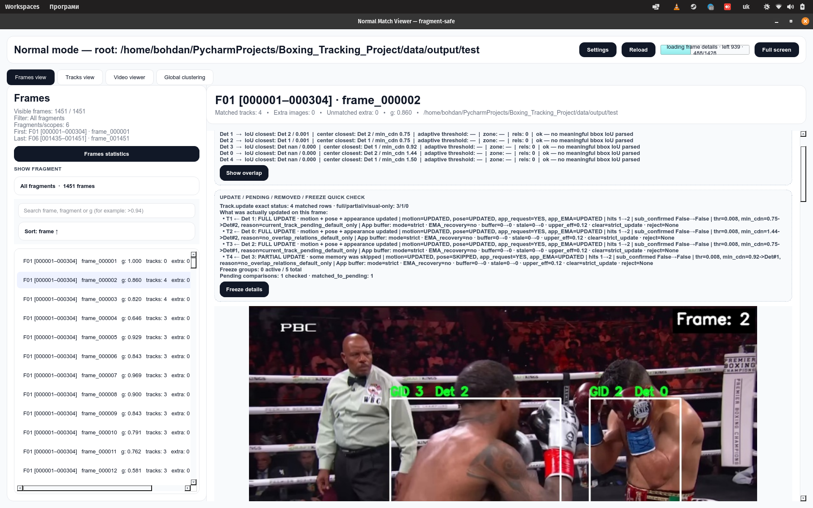

# Boxing-Specific Multi-Object Tracking

A computer vision pipeline for tracking boxers through fast motion, close-range exchanges, missed detections, and broadcast camera cuts.

This project was built to solve a practical problem in boxing analysis: before you can classify punches or count boxer-specific actions, you first need stable identities over time.

<p align="center">
  <a href="https://github.com/Bohdanvtk/Boxing_Tracking_Project/releases/latest">
    
  </a>
</p>

<p align="center">
  <a href="https://github.com/Bohdanvtk/Boxing_Tracking_Project/releases/latest"><b>▶&nbsp; Watch the full tracking demos</b></a>
  <br/>
  <sub>full local-ID and global-ID runs in higher quality — click the preview above or this link</sub>
</p>

## Project Status

This repository is released as a **complete research prototype**. It is **not
under active development**, and no further features are planned in the near
future — the code, the published Docker image and the demos are provided as-is.
The *Possible Future Directions* at the end are ideas, not committed work.

## Why This Project Exists

Pose detectors can find people and keypoints on individual frames, but they do not reliably preserve identity over time.

In boxing, that becomes a major problem:

- fighters move quickly;
- they overlap often;
- body parts disappear during clinches and close exchanges;
- detections can be noisy or missing;
- the broadcast frequently cuts to a different camera angle.

Without a tracker, the same temporal sequence can accidentally combine skeletons from different athletes. That makes punch classification, punch counting, and per-boxer analysis unreliable.

This project solves that identity problem first.

<p align="center">
  
</p>

## What The Tracker Does

The tracker combines three types of evidence when deciding which detection belongs to which boxer:

- **motion** — whether a detection agrees with the predicted track position;
- **pose** — whether the current skeleton matches the previous body configuration;
- **appearance** — whether the boxer still looks visually similar.

That makes the system more robust than a simple frame-to-frame skeleton comparison.

<p align="center">
  
</p>

Pose comparison is treated as useful, but not fully trustworthy on its own, because boxing posture changes quickly and some joints may be partially hidden.

<p align="center">
  
</p>

The appearance representation is also boxing-specific. Instead of relying only on a generic body embedding, the tracker can combine:

- body appearance;
- left glove color information;
- right glove color information;
- shorts color information.

This makes it easier to distinguish visually similar fighters in difficult scenes.

## Why Overlap Handling Matters

Boxers often move into close contact. In these moments, a normal tracker can easily corrupt identity memory because the crop or skeleton may contain mixed information from both athletes.

To reduce that risk, this tracker includes overlap-aware logic such as:

- adaptive overlap thresholds;
- partial track updates;
- temporarily blocked appearance updates;
- freeze logic for risky identity states.

<p align="center">
  
</p>

The system also uses a temporary buffer for medium-confidence appearance observations. That allows the tracker to save potentially useful visual evidence without immediately contaminating the main identity representation.

<p align="center">
  
</p>

## Why New Tracks Are Created Conservatively

Not every unmatched detection should immediately become a confirmed track.

In fast boxing footage, noisy detections can appear briefly and disappear again. To avoid creating unstable identities, the tracker uses a conservative birth process.

<p align="center">
  
</p>

A new candidate must survive long enough and collect enough evidence before it becomes a stable confirmed track.

This helps reduce duplicate tracks and short-lived false identities.

## Local Tracks And Global Boxer Identities

The project separates identity handling into two levels:

- **local tracks** preserve identity inside one continuous camera segment;
- **global identities** merge compatible local fragments across different camera shots.

This distinction matters because a broadcast camera cut can completely change viewpoint, scale, and visible body regions.

### Local Tracking Inside One Camera Segment

Inside a single shot, the tracker maintains local track IDs frame by frame.

<p align="center">
  
  
</p>

After a camera cut, the same boxer may receive a different **local ID**, because local tracking restarts in a new shot context.

### Global Identity Recovery Across Camera Cuts

After local tracking is finished, the system compares track fragments across different epochs and groups compatible fragments into a shared global boxer identity.

<p align="center">
  
  
</p>

These two fragments can look different because of viewpoint changes, but they still belong to the same boxer. That is why the project uses **local IDs** and **global IDs** separately.

The final result is a scene where multiple local fragments can be consolidated into stable global boxer identities.

<p align="center">
  
</p>

For this step, stable local fragments are compared using track-level appearance representations, and conservative clustering is used to recover cross-shot identity continuity.

<p align="center">
  
</p>

## Why This Project Is Useful

This tracker is not only a visualization tool.

It is meant to be a foundation for downstream boxing-analysis tasks such as:

- punch classification;
- punch counting per boxer;
- temporal action recognition;
- boxer-specific movement analysis;
- later dataset preparation for learning-based models.

In other words, the project solves a prerequisite problem: it makes boxer-centered temporal analysis possible.

## Project Structure

The repository uses a standard `src` layout:

```text
Boxing_Tracking_Project/
├── pyproject.toml
├── configs/
│   ├── infer_tracks.yaml
│   ├── tracking.yaml
│   ├── birth_manager.yaml
│   └── shot_boundary.yaml
├── scripts/
│   ├── infer_tracks.py
│   ├── train_reid_osnet_siamese.py
│   └── export_reid_onnx.py
└── src/
    └── boxing_project/
        ├── tracking/
        ├── results/
        └── reid_training/
```

The installable Python package is `boxing_project`. Runtime orchestration,
results access, and optional ReID training code are kept in separate
subpackages so that each responsibility remains explicit.

## Quick Start

### Docker (recommended for full inference)

The full pipeline needs OpenPose, CUDA, cuDNN and Caffe. Instead of installing
those natively, use the prebuilt Docker image — it bundles OpenPose (BODY_25),
the appearance model and the tracking code, so the only host requirement is an
NVIDIA GPU with the NVIDIA Container Toolkit:

```bash
docker pull ghcr.io/bohdanvtk/boxing-tracking:runtime

docker run --rm --gpus all --shm-size=2g \
  --user "$(id -u):$(id -g)" -e HOME=/tmp \
  -v /absolute/path/to/video.mp4:/data/input/video.mp4:ro \
  -v /absolute/path/to/output:/data/output \
  ghcr.io/bohdanvtk/boxing-tracking:runtime
```

> **Where do the configs come from here?** When you run the published image
> directly like this, the pipeline uses the YAML configs **baked into the image
> at build time** (`infer_tracks.yaml`, `tracking.yaml`, `birth_manager.yaml`,
> `shot_boundary.yaml`). You do **not** need a local `configs/` folder, and
> editing your local `configs/*.yaml` has **no effect** on this run — the
> container only reads its own embedded copy. To run with your own edited
> configs instead, use the `run-runtime.sh` script in live mode (see the
> [Docker runtime guide](README_RUNTIME.md) → *Live configs*).

For building the image yourself, GPU portability, running options and publishing,
see the dedicated **[Docker runtime guide](README_RUNTIME.md)**.

### Python Package Installation

From the repository root, install the project in editable mode:

```bash
python -m pip install -e .
```

Editable mode registers `src/boxing_project` as an importable package while
keeping it connected to the source tree. Changes made under `src/` are
therefore available immediately, without reinstalling the project after every
edit.

After installation, imports work normally:

```python
from boxing_project.tracking.infer_runner import InferRunner
from boxing_project.results import BoxingResults
```

No manual `PYTHONPATH=src` prefix is required.

> `pyproject.toml` installs the Python dependencies of the project. OpenPose,
> CUDA, cuDNN, Caffe, and other native runtime components still need to be
> installed separately. The Docker runtime remains the recommended option for
> reproducible full inference.

For lightweight result consumption only:

```bash
python -m pip install -r requirements/results.txt
```

This installs only the libraries required to read and work with
`observations.parquet`.

### Inference

The complete inference run is configured through:

```text
configs/infer_tracks.yaml
```

Run the pipeline from the repository root:

```bash
python scripts/infer_tracks.py
```

The same runner can also be used directly as a Python module:

```python
from pathlib import Path

from boxing_project.tracking.infer_runner import InferRunner

InferRunner(Path("configs/infer_tracks.yaml")).run()
```

Configuration responsibilities are intentionally separated:

```text
configs/infer_tracks.yaml     runtime, input, output, enabled stages, batch sizes
configs/tracking.yaml         matching, lifecycle, overlap, and clustering parameters
configs/birth_manager.yaml    pending-track and track-birth behaviour
configs/shot_boundary.yaml    camera-cut detection
```

The inference pipeline is organised into seven stages:

```text
1. Preprocessing
2. Detection Preparation
3. Local Tracking
4. Local Detection Saving
5. Global Clustering
6. Global Saving
7. Dataset Export
```

Stages can be enabled or disabled in `configs/infer_tracks.yaml`. Later stages
depend on the outputs of the earlier stages they consume.

### Tuning global clustering quality

If the global identities are not grouped the way you expect (boxers split into
too many IDs, or different boxers merged into one), the single most important
knob is:

```yaml
# configs/tracking.yaml
tracking:
  graph_clustering:
    pair_threshold: 0.76   # how similar two tracks must be to share a global ID
```

`pair_threshold` is the minimum appearance similarity required between *every*
pair of tracks before they are merged into one global boxer identity:

- **raise it** (e.g. `0.80`) to be stricter — fewer wrong merges, but the same
  boxer may be split into several global IDs;
- **lower it** (e.g. `0.70`) to be more permissive — more fragments get merged,
  but at a higher risk of merging two different boxers.

When clustering quality is unsatisfactory, tune this value first.

> If you are running inside Docker, remember that editing `configs/tracking.yaml`
> only changes the run when the configs are mounted live (`run-runtime.sh` in its
> default mode). A direct `docker run` of the published image keeps using the
> embedded `pair_threshold` — see the [Docker runtime guide](README_RUNTIME.md).

## Appearance ReID Fine-Tuning

The tracker compares boxers using an appearance embedding (an OSNet-style ONNX
model). The repository includes an **optional** workflow to fine-tune that model
on boxing footage — needed only when creating or improving the appearance model;
normal inference simply uses an existing ONNX.

See the dedicated **[Appearance ReID fine-tuning guide](README_REID_TRAINING.md)**
for the training dependencies, the pair-dataset format, training/resuming
commands and ONNX export.

## Dataset Output

The final pipeline stage assembles a single public dataset file:

```text
<save_dir>/dataset/observations.parquet
```

Each row is one active local track on one frame — including frames where the
detection was missed (the track stays alive with its predicted geometry but
without a detection payload). Geometry (`bbox_*`, `center_*`) always comes from
the track state; large appearance embeddings and internal/debug fields are not
exported (only `has_*` availability flags and `e_app_coverage` are kept).
`global_track_id` is `null` for local tracks without a confident global
assignment.

Reading it back:

```python
import pandas as pd
obs = pd.read_parquet("data/output/test/dataset/observations.parquet")

# a specific local track on a specific frame
row = obs[(obs.epoch_id == 6) & (obs.local_track_id == 2) & (obs.frame_idx == 348)]
bbox = row.iloc[0][["bbox_x1", "bbox_y1", "bbox_x2", "bbox_y2"]].tolist()

# all observations of a global boxer
boxer = obs[obs.global_track_id == 1].sort_values(["epoch_id", "frame_idx"])

# a frame range
segment = obs[(obs.global_track_id == 1) & obs.frame_idx.between(300, 400)]
```

### Results API

For convenience, `boxing_project.results` is a small read-only wrapper (numpy +
pandas only) that turns the parquet into ordered per-boxer sequences ready for
downstream models:

```python
from boxing_project.results import BoxingResults

results = BoxingResults("data/output/test")  # or .../dataset/observations.parquet

segment = (
    results
    .global_id(1)
    .epoch(6)
    .window(start_frame=444, length=20)
)

model_input = segment.kps            # (20, 25, 3)  -> [x, y, confidence]
model_mask = segment.detection_mask  # (20,)        -> True where a real detection exists
```

`window(start_frame, length)` always returns exactly `length` time positions,
padding frames with no observation; `frames(start, end)` returns only the rows
that really exist in the inclusive range. Shapes:

```python
segment.frames.shape            # (20,)
segment.bbox.shape              # (20, 4)
segment.kps.shape               # (20, 25, 3)
segment.observation_mask.shape  # (20,)
segment.detection_mask.shape    # (20,)
```

A selection that spans several boxers is split with `selection.segments()`,
which returns a `SegmentCollection` keyed by global id.

## Optional Result Viewers (experimental)

<p align="center">
  
</p>
<p align="center">
  <sub>Step through every frame and inspect detections, matching decisions, local IDs and recovered global identities.</sub>
</p>

Two small desktop GUIs are available to visually inspect the tracking results.
They are **auxiliary debug tools, not part of the core pipeline** — rough,
quickly-made helpers that just make it easier to look at the output.

- **standard** (`jj.py`) — more detailed; best for short clips;
- **small** (`jj_small.py`) — faster, with fewer features; best for long videos.

Both are single-file PySide6 (Qt) desktop apps. On launch they open a file
dialog; point them at a **finished pipeline output folder** — the `.../test`
directory that holds `preprocessed/`, `local_tracking/`, `global_clustering/`
and `dataset/` — and they render the tracks frame by frame, so you can step
through detections, local IDs and recovered global identities to sanity-check a
run. The standard build (`jj.py`) draws more per-frame detail and is comfortable
on short clips; the small build (`jj_small.py`) trims features for speed and is
the one to use on long videos.

### Running a viewer

Download the bundle from the [latest release](https://github.com/Bohdanvtk/Boxing_Tracking_Project/releases/latest)
(`boxing-tracking-viewers.zip`), unzip it, then run either script with a Python
that has the dependencies installed:

```bash
python jj.py          # standard, detailed — short clips
python jj_small.py    # small, faster — long videos
```

The scripts already force software rendering internally, so a plain `python …`
is usually enough. If the window fails to open on some Linux/GPU setups, run it
through the X11 platform plugin instead:

```bash
QT_QPA_PLATFORM=xcb python jj_small.py
```

They rely on **PySide6, OpenCV, pandas, pyarrow and NumPy**. Dependency versions
are intentionally not pinned, so the environment setup can be finicky — treat
these viewers as experimental, provided as-is: they can be unstable, and the
standard one in particular may take a while to load on larger outputs.

## Current Limitations

- difficult long overlaps can still cause identity errors;
- tracking quality depends on detection and keypoint quality;
- some global matches remain ambiguous after severe viewpoint changes;
- the current implementation is a research-oriented engineering prototype.

## Possible Future Directions

The project is complete and not under active development; the items below are
**ideas, not planned work**:

- improve the public inference API;
- make ReID ONNX export architecture-configurable and checkpoint-safe;
- add quantitative tracking evaluation;
- extend global identity recovery across harder camera switches;
- integrate downstream punch-classification models.
