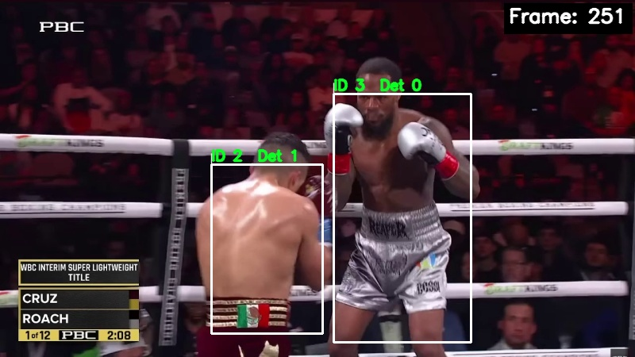
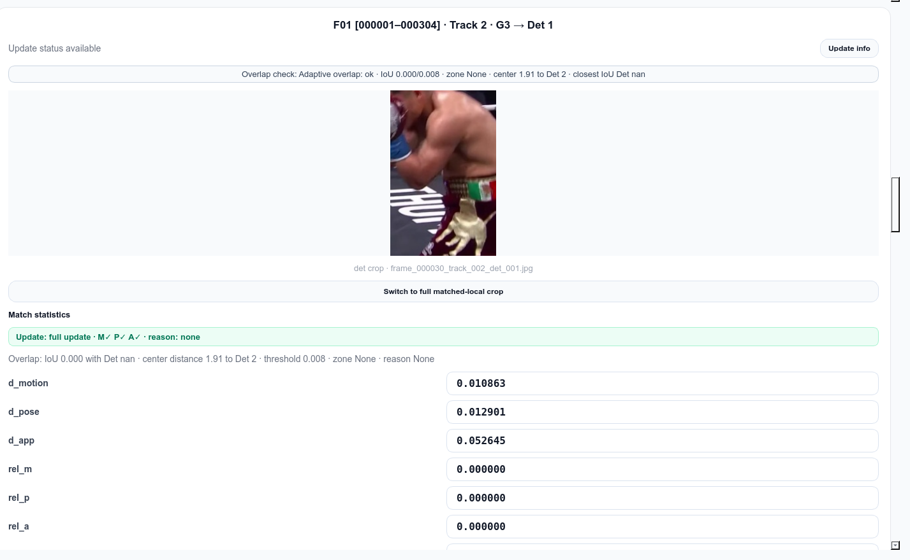
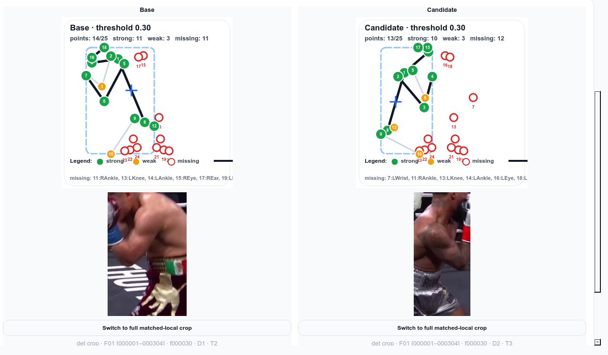
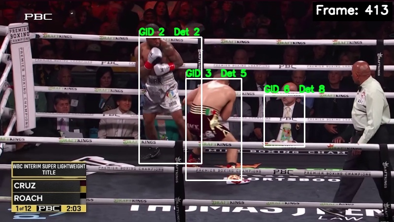
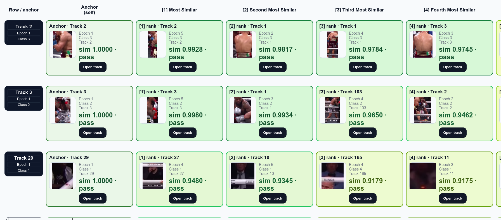

# Boxing-Specific Multi-Object Tracking

A computer vision pipeline designed to preserve boxer identities through fast motion, close-range overlap, partial occlusion, missed detections, and broadcast camera cuts.

<p align="center">
  
</p>

## Overview

This project implements a multi-object tracking system specialized for boxing footage.

The tracker was developed as a foundation for downstream boxing-analysis tasks such as:

* punch classification;
* punch counting;
* per-boxer event attribution;
* temporal pose analysis;
* movement and action recognition.

Pose-estimation systems such as OpenPose can detect people and body keypoints independently on each frame. However, they do not reliably preserve the identity of each detected person over time.

Without stable boxer identities, skeletons from different athletes can be mixed inside the same temporal sequence. This makes punch classification and per-boxer statistics unreliable.

The purpose of this project is therefore to provide stable boxer tracks before higher-level action-recognition models are applied.

<p align="center">
  
</p>

## Why Boxing Tracking Is Difficult

Boxing footage contains several challenges that are less common in ordinary pedestrian tracking:

* very fast and irregular movement;
* frequent close-range overlap;
* partial or complete body occlusion;
* missing or noisy keypoints;
* visually similar athletes;
* large pose changes;
* frequent camera cuts and perspective changes;
* small visible regions during close exchanges.

A simple frame-to-frame skeleton comparison is not sufficient.

When a pose detector misses a boxer for several frames, the next detected skeleton can easily be attached to the wrong temporal sequence. During close exchanges, keypoints from two athletes can also become mixed or unstable.

Camera cuts create an additional problem: the same boxer can appear from a completely different perspective, making direct keypoint comparison unreliable.

## System Pipeline


The system separates tracking into two levels:

1. **Local tracking** preserves identity inside continuous camera segments.
2. **Global clustering** connects compatible track fragments across different camera epochs.

## Multi-Cue Matching

The local tracker does not rely on a single similarity measurement.

Each possible track–detection pair is evaluated using three complementary distances:

* `d_motion` — consistency with the Kalman-filter motion prediction;
* `d_pose` — similarity between normalized body-keypoint structures;
* `d_app` — visual similarity between appearance representations.

<p align="center">
  
</p>

These signals are combined to determine which detection most likely belongs to each existing track.

The matching system first ranks candidates from the perspective of each track and then resolves conflicts when multiple tracks prefer the same detection.

This is more robust than assigning detections using only nearest-neighbor distance or only skeleton similarity.

## Pose Comparison

Pose similarity is calculated from the available body keypoints.

The comparison explicitly accounts for:

* reliable keypoints;
* low-confidence keypoints;
* missing body joints;
* normalization of the skeleton geometry.

<p align="center">
  
</p>

Pose information is useful for local identity association, but it is not treated as fully reliable because boxing poses can change significantly between consecutive frames.

## Boxing-Specific Appearance Representation

The appearance descriptor combines multiple visual signals:

* a body appearance embedding;
* HSV information from the left glove;
* HSV information from the right glove;
* HSV information from the boxer’s shorts.

The individual feature vectors are weighted, concatenated, and normalized into a unified appearance representation.

This allows the system to use boxing-specific visual cues instead of relying only on a generic full-body embedding.

The tracker also stores information about which appearance regions are visible. Missing gloves, hidden shorts, or partially visible body regions therefore do not have to be treated as complete appearance observations.

## Overlap-Aware Tracking

Boxers frequently overlap during close exchanges.

During these moments, appearance crops and body keypoints can contain information from both athletes. Updating a track normally with such observations can permanently corrupt its identity representation.

The tracker therefore maintains overlap groups and applies adaptive overlap thresholds based on:

* distance between athletes;
* track stability;
* current overlap conditions;
* visibility and confidence of the observation.

When an update is considered risky, the tracker can perform a **partial update**:

* motion can still be updated using a reduced-strength measurement;
* pose updates can be blocked;
* appearance updates can be blocked;
* identity memory can be temporarily frozen.

Source-based freeze counters protect related tracks after a boxer disappears from an overlap group. This reduces the risk of immediately assigning contaminated appearance information to the remaining boxer.

## Appearance Recovery Buffer

Appearance updates are not handled only as accepted or rejected.

Medium-confidence appearance observations can be placed into a temporary recovery buffer.

The buffer allows the tracker to preserve potentially useful evidence without immediately modifying the main appearance representation.

When enough consistent observations accumulate, buffered embeddings can be applied through a cautious batch update.

This mechanism is useful when:

* a boxer is partially visible;
* the crop is imperfect;
* appearance information is temporarily stale;
* the observation is useful but not reliable enough for a direct update.

## Conservative Track Creation

Unmatched detections do not immediately become permanent tracks.

They first become **pending candidates** and must collect enough evidence over multiple frames.

<p align="center">
  
</p>

The track lifecycle is approximately:

```text
pending → unconfirmed → subconfirmed → confirmed
```

* **Pending candidates** represent possible new identities.
* **Unconfirmed tracks** have been promoted but are still unstable.
* **Subconfirmed tracks** have accumulated enough evidence to participate in more reliable overlap handling.
* **Confirmed tracks** represent stable identities.

The number of old unconfirmed tracks is limited to prevent unstable detections from creating an unlimited number of identities.

Newborn tracks are temporarily protected so that they are not removed immediately after creation.

## Camera Cuts and Tracking Epochs

Broadcast boxing videos frequently switch between cameras.

A hard camera cut can change:

* the apparent skeleton geometry;
* body scale;
* viewpoint;
* visible clothing regions;
* spatial position of both athletes.

The project uses shot-boundary detection to divide the video into local tracking epochs.

Local identity continuity is handled inside each epoch. Track fragments are then compared offline to recover global boxer identities across camera changes.

<p align="center">
  
</p>

## Global Identity Clustering

Each sufficiently stable local track is represented using its accumulated appearance history.

Track-level appearance representations are compared using cosine similarity, and compatible fragments are conservatively grouped into global identities.

<p align="center">
  
</p>

The clustering method intentionally requires strong internal agreement between grouped track fragments.

This reduces incorrect identity merges, although ambiguous fragments can remain unassigned.

The appearance used for global clustering is based on track-level aggregation of the fused local appearance descriptors containing body, glove, and shorts information.

## Demo Videos

### Local Tracking

[](VIDEO_URL_1)

### Overlap Handling and Matching Debugger

[](VIDEO_URL_2)

### Tracking Across Camera Cuts

[](VIDEO_URL_3)

## Quick Start

The inference pipeline is configured through:

```text
configs/infer_tracks.yaml
```

Run the tracker from the repository root:

```bash
PYTHONPATH=src python scripts/infer_tracks.py
```

The main tracking parameters are located in:

```text
configs/tracking.yaml
configs/birth_manager.yaml
configs/shot_boundary.yaml
```

Model paths, input-video paths, and runtime settings should be configured before starting inference.

## Main Components

```text
src/boxing_project/tracking/
├── infer_runner.py
├── tracking_stages.py
├── tracker.py
├── matcher.py
├── track.py
├── overlap_manager.py
├── birth_manager.py
├── birth_update_pipeline.py
├── global_clustering.py
└── inference_utils.py
```

## Current Limitations

* Difficult long-term overlaps can still produce identity errors.
* Tracking quality depends on pose-detection quality.
* Large appearance changes can make global association ambiguous.
* Global clustering is intentionally conservative and may leave some fragments unassigned.
* Some thresholds are currently tuned specifically for boxing footage.
* The current implementation is a research and engineering prototype rather than a production-ready tracking library.

## Future Work

* Improve the public inference API.
* Add structured export for downstream action-recognition models.
* Evaluate the tracker on a labeled boxing-tracking dataset.
* Improve global identity recovery across difficult camera cuts.
* Add automated tests and quantitative tracking metrics.
* Integrate punch classification and punch counting.